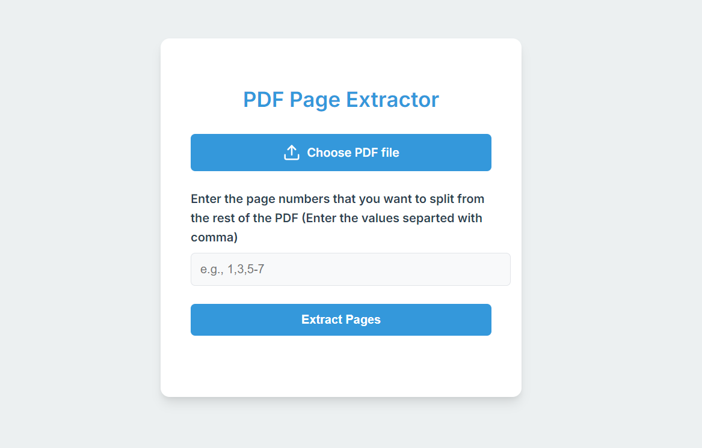

# PDF Page Extractor

This tool allows you to extract specific pages from a PDF document and save them as a new file through a web interface. Whether you're working with long PDF files and only need certain sections, or you want to split a PDF into multiple parts, this project makes it simple and efficient.

## Features

- Extract specific pages from a PDF file
- Save the extracted pages as a new PDF document
- Supports multiple page ranges (e.g., `1-3,5,7-9`)
- Simple and intuitive web interface

## Requirements

Before running the application, ensure you have the following installed:

- Python 3.8+
- `Flask` and `PyPDF2` libraries (to install: `pip install Flask PyPDF2` or installing via requirements.txt)

## Installation

1. Clone the repository:

   \`\`\`bash
   git clone https://github.com/CosminB24/pdf-page-extractor.git
   \`\`\`

2. Navigate to the project directory:

   \`\`\`bash
   cd pdf-page-extractor
   \`\`\`

3. Install dependencies:

   \`\`\`bash
   pip install -r requirements.txt
   \`\`\`

## Usage

1. Run the Flask server:

   \`\`\`bash
   python app.py
   \`\`\`

2. Open your browser and go to `http://127.0.0.1:5000/`.

3. Upload a PDF file and specify the page ranges you'd like to extract (e.g., `1-3,5,7-9`).

4. Download the newly generated PDF with only the specified pages.

## Example

To extract pages 1, 2, 5, and 7-9 from a PDF:

1. Start the app by running `python app.py`.
2. In your browser, upload `example.pdf`.
3. Enter `1-2,5,7-9` (the values have to be separated by comma) as the page range.
4. Click 'Extract' to download the new PDF.

---

## Contributing

Contributions are welcome! Feel free to fork the repository, make improvements, and submit a pull request. Ensure your code adheres to the established coding standards and includes relevant tests.

## License

This project is licensed under the MIT License. See the [LICENSE](LICENSE) file for more details.
